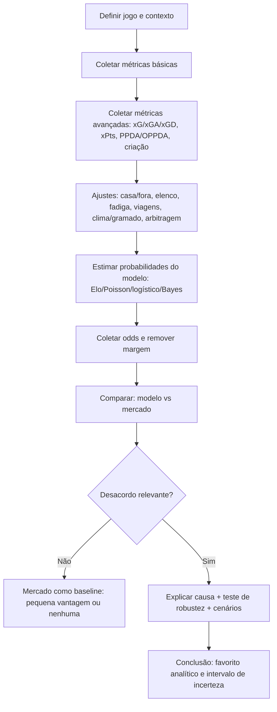

# Como determinar o favorito analítico em um jogo de futebol quando as odds “não mostram” isso

## Resumo executivo

Em futebol, “favorito” pode ser entendido como **o time com maior probabilidade real de vencer** (mesmo que essa probabilidade ainda seja <50% por causa do empate). As casas de apostas traduzem essa crença em odds, mas as odds **incluem margem (overround)** e podem incorporar **vieses/ajustes comerciais** (por exemplo, distorções sistemáticas como o *favourite–longshot bias* em alguns mercados). citeturn7view0turn0search36turn5search8turn5search20turn5search6

Na prática, identificar um “favorito analítico” quando as odds estão altas para esse time exige comparar duas coisas:  
1) **o que o mercado precifica** (probabilidades implícitas sem margem), e  
2) **o que seus modelos/dados indicam** (probabilidade estimada por métricas de desempenho + contexto). citeturn7view0turn5search22turn5search2

Três padrões costumam explicar por que um time pode estar “mal precificado” e ainda assim ser o melhor lado no jogo:  
- **Resultados recentes enganosos**: tabela e placares podem esconder desempenho subjacente (ex.: xG diferencial alto, mas pontos baixos), fenômeno ligado à variância e regressão à média; xG tende a ser mais estável/preditivo do que gols “puros” em horizontes apropriados. citeturn6search1turn6search8  
- **Informação contextual subponderada**: lesões/retornos, calendário congesto, viagem, mando, clima/gramado e até efeitos de arbitragem (incluindo mudanças com VAR) podem deslocar a probabilidade real — e nem sempre o mercado ajusta com a mesma velocidade/intensidade em todas as ligas e tipos de jogo. citeturn2search3turn2search34turn4search0turn4search24turn4search5  
- **Vieses e microestrutura do mercado**: mercados 1X2 (casa/empate/fora) e ligas menos líquidas podem exibir vieses (ex.: *favourite–longshot bias* e distorções em empates), enquanto odds de fechamento tendem a ser, muitas vezes, estimativas mais “informadas” do que odds de abertura (embora haja exceções). citeturn5search6turn5search20turn5search2turn5search14

O ponto crítico: **o mercado geralmente é um baseline forte** (frequentemente mais forte que modelos simples), então “discordar do mercado” só é racional quando você consegue explicar *por que* ele está errado e ainda **quantificar o quanto** — com análise de sensibilidade, checagem de dados e controle de risco. citeturn5search22turn5search2turn4search3

## Conceitos fundamentais e fontes de dados prioritárias

### O que você está tentando estimar

Você quer estimar um vetor de probabilidades pré-jogo:

\[
\mathbf{p} = (P(X\ vence),\ P(empate),\ P(Y\ vence)),
\quad \sum p_i = 1.
\]

As odds do mercado são um “proxy” disso, mas com margem e potenciais vieses. Remover margem e comparar com seu \(\mathbf{p}\) é o primeiro passo rigoroso. citeturn7view0turn0search36

### Fontes recomendadas (com prioridades práticas)

A escolha de fonte importa porque **definições e modelos variam** (ex.: diferentes modelos de xG; diferentes critérios de evento como “assist”, “pressão”, “ação defensiva”). Priorize fontes com documentação/glossários. citeturn2search5turn2search13turn0search11turn7view0

**Primárias e “quase-primárias” (mais confiáveis para decisão pré-jogo):**
- Sites oficiais de clubes e competições (boletins médicos, suspensões, coletiva, logística, provável escalação).  
- Provedores e plataformas de dados/eventos e seus glossários: entity["company","StatsBomb","football data provider"] (glossários e *event descriptions*), entity["company","Stats Perform","sports data company"]/entity["company","Opta","sports data brand"] (definições de eventos). citeturn2search28turn2search5turn2search13  
- Plataformas de análise e scouting (especialmente para PPDA/pressão, estilos): entity["company","Wyscout","football scouting platform"]. citeturn0search19turn0search11  
- Repositórios/portais de estatísticas amplamente usados por analistas (com cautela sobre acesso/definições): entity["company","FBref","football stats site"] e entity["company","Understat","xg stats website"] (úteis para xG/xGA/xGD e tendências, lembrando que modelos podem diferir). citeturn6search21turn6search1  
- Informações de elenco/ausências e contexto de transferências/valores (boas para “profundidade de banco” como proxy): entity["company","Transfermarkt","football transfer site"] (usar como fonte auxiliar, não como “verdade oficial” médica).  
- Agregadores de desempenho ao vivo e histórico recente (boa cobertura, mas validar metodologia): entity["company","SofaScore","sports scores app"].  

**Mercado de apostas (para odds, movimentos e comparação entre casas):**
- Odds e históricos de linha via casas e/ou comparadores; para leitura de liquidez e “sabedoria do mercado”, inclua bolsa (exchange) como entity["company","Betfair","betting exchange"] e sportsbooks de referência (ex.: entity["company","Pinnacle","sportsbook"], entity["company","bet365","sportsbook"]). citeturn5search0turn5search6turn4search3  

**Ferramentas de cálculo (úteis para de-vig e auditoria):**
- Biblioteca/documentação com múltiplos métodos de remoção de margem (multiplicativo, Shin, power etc.), como entity["organization","Penaltyblog","football analytics library"]. citeturn7view0  

## Dimensões estatísticas e contextuais que realmente mudam quem é favorito

Abaixo, a lógica central é sempre a mesma: você tenta estimar **força ofensiva** e **força defensiva** (e volatilidade) de X e Y, condicionando por contexto (mando, elenco disponível, fadiga, estilo, clima etc.). Modelos consagrados na literatura partem de contagens de gols (Poisson e variantes) e/ou incorporam informação de mercado, por exemplo em abordagens inspiradas em Dixon–Coles e estudos posteriores. citeturn1search6turn6search34turn5search22

### Estatísticas básicas (o “piso” da análise)

Use como triagem e consistência, não como motor principal:

- **Gols marcados por jogo / gols sofridos por jogo / saldo**: capturam resultado, mas têm ruído alto em amostras curtas. Modelos de processos de gols (Poisson) ajudam a separar o que é taxa média do que é variância. citeturn6search34turn1search6  
- **Aproveitamento (pontos por jogo)**: útil para “estado de tabela” e motivação, porém também herda ruído dos placares. A ideia por trás de *expected points* é justamente medir “o que deveria ter acontecido” dado o volume/qualidade de chances. citeturn1search13turn1search9  

Onde isso ajuda a “contrariar odds”? Em especial quando:  
- X tem desempenho de placar ruim, mas não há evidência estrutural de queda (ex.: sequência de derrotas por detalhes), e as métricas avançadas sustentam que a força permanece. citeturn6search1turn6search8  

### Métricas avançadas (onde geralmente aparece o “favorito escondido”)

**Expected Goals (xG) e derivados**
- xG é **probabilidade de um chute virar gol** com base em características do lance; totalizar xG ao longo de jogos mede qualidade/volume de chances criadas e tende a ser mais estável do que gols, especialmente porque gols são eventos raros e sujeitos a deflexões/variância. citeturn0search10turn0search14turn6search8turn6search1  
- **xGA** (xG contra) mede a qualidade das chances que o time permite.  
- **xG diferencial (xGD = xG − xGA)** é um resumo poderoso de dominância de chances; estudos empíricos mostram xG como preditor superior de sucesso futuro em comparação com estatísticas tradicionais. citeturn6search1turn6search13  

**Eficiência por finalização**
- **G/shot (conversão)** = gols ÷ chutes: é simples, mas mistura habilidade e contexto do chute; variações podem refletir seleção ruim de chutes (muitos chutes de baixa qualidade) e azar/sorte. Por isso, métricas esperadas costumam ser mais estáveis. citeturn6search32turn6search8  
- **xG/shot** (qualidade média dos chutes) frequentemente é melhor para entender estilo (volume vs qualidade). A intuição: dois times podem ter o mesmo xG total, mas um com menos chutes mais “claros” (xG/shot maior). citeturn0search14turn6search1  

**Pressão e estilo defensivo: PPDA e OPPDA**
- PPDA (*passes per defensive action*) mede, em termos operacionais, quantos passes o adversário consegue trocar em zonas de construção antes de sofrer uma ação defensiva; é usado como **proxy de intensidade de pressão** (menor PPDA → mais pressão). citeturn0search19turn0search3turn6search7  
- Limitação essencial: PPDA pode ficar baixo não só por “pressão coordenada”, mas por dominância territorial/posse que faz as ações defensivas ocorrerem alto. Por isso, combine PPDA com contexto e outras medidas de sucesso de pressão. citeturn6search7turn6search3turn6search11  
- **OPPDA** (variações de “opponent PPDA”): útil como leitura do quanto você **sofre pressão** (se o adversário, em média, permite poucos passes antes de agir defensivamente, você terá OPPDA baixo e pode ter dificuldade de sair jogando). A definição exata varia por fornecedor, então documente o glossário adotado. citeturn0search11turn0search19  

**Criação de chutes (Shot-Creating Actions)**
- “Shot-creating actions” é um conceito de cadeia de criação que credita as ações ofensivas que antecedem um chute (definições variam; alguns frameworks contam as duas ações imediatamente anteriores ao chute). Isso ajuda a diferenciar times que “chegam por acaso” vs times que consistentemente constroem finalizações. citeturn2search16turn2search20  

**Expected Points (xPts / xP)**
- xPts usa probabilidades de vitória/empate/derrota estimadas a partir do perfil de chances (geralmente via xG) e transforma em pontos esperados (3·P(win) + 1·P(draw) + 0·P(loss)). Ele é útil como “placar de justiça” e pode sinalizar *overperformance/underperformance* em pontos. citeturn1search13turn1search9turn1search5  

image_group{"layout":"carousel","aspect_ratio":"16:9","query":["mapa de chutes expected goals xG futebol exemplo","gráfico xG xGA diferencial por jogo futebol","diagrama PPDA pressão alta futebol","tabela expected points xPts futebol exemplo"],"num_per_query":1}

### Forma recente e recortes (últimos 5/10/20, casa/fora, adversários)

**Forma recente** é necessária, mas perigosa. A boa prática:

- Calcular janelas de **5/10/20 jogos**, mas ponderar por (a) força do adversário, (b) mando, (c) lineup disponível. Modelos “dinâmicos” e abordagens de rating (tipo Elo) existem justamente para capturar mudanças de força no tempo. citeturn1search6turn1search11turn1search7  
- Preferir forma baseada em **xG/xGA rolling** (ex.: média móvel de xGD) em vez de apenas resultados — porque xG tende a ser mais informativo sobre performance futura do que gols. citeturn6search1turn6search17  

**Casa/fora**  
- “Home advantage” é fenômeno bem documentado, mas seu tamanho varia por liga, época e contexto (crowd, logística, arbitragem, etc.). Revisões e estudos recentes continuam investigando como/quanto ele afeta desempenho. citeturn2search18turn2search2turn2search25  
- Uma parte do efeito pode ser mediada por decisões de arbitragem/crowd; evidências de jogos sem torcida sugerem mudanças em viés de arbitragem e/ou vantagem de casa. citeturn4search8turn4search24turn4search4  

### Confronto direto, lesões/suspensões, escalações prováveis e “contexto de calendário”

**Confrontos diretos (H2H)**  
- Use como contexto tático e histórico psicológico, mas com parcimônia: H2H sofre com mudanças de elenco/técnico e amostras pequenas. (Aqui, a recomendação é metodológica: H2H raramente deve dominar a previsão.)

**Lesões/suspensões e escalações prováveis**  
- Esse fator raramente é capturado bem por médias históricas “cegas”: um desfalque pode afetar o time de modo não linear (ex.: zagueiro que é o “pino” da saída; único ponta com profundidade; goleiro acima da média). Em modelos, trate como ajuste de força (ex.: xGA piora com ausência de um zagueiro de elite; capacidade de progressão cai com ausência de um volante).  
- A incerteza aqui exige análise de sensibilidade: preveja com (a) jogador provável, (b) dúvida fora, (c) substituto.  

**Viagens e fadiga / calendário congesto**  
- Revisões sistemáticas e meta-análises sugerem que congestão pode não derrubar algumas métricas físicas agregadas, mas há evidências de efeitos em fadiga, recuperação e **aumento de incidência de lesões em períodos congestionados**. citeturn2search3turn2search34  
- Entidades de jogadores e estudos aplicados recomendam salvaguardas (descanso, semanas de recuperação etc.) diante de sobrecarga do calendário, reforçando que “cansaço” não é só narrativa: é variável real de risco/performance. citeturn2news39  

### Motivação, táticas/estilos e profundidade de elenco

**Motivação** (título, rebaixamento, copas, clássico, “jogo de 6 pontos”)  
- Difícil quantificar sem cair em narrativa; mas você pode usar proxies: necessidade de resultado (tabela), rotação provável, priorização de competição, e sinais do treinador (coletivas/escalações).  
- Em copas e mata-mata, as preferências de risco mudam (ex.: jogar por empate/penaltis; administrar 1–0), e isso influencia o empate/under mais do que o 1X2.

**Táticas e estilos**  
- O ponto prático: *matchup* pode vencer médias. Ex.:  
  - Time X sofre sob pressão (OPPDA baixo) e Y pressiona muito (PPDA baixo) → saídas quebradas, mais perdas em zona perigosa. citeturn0search19turn6search7  
  - Time X cria muito via cruzamentos/bola parada; Y é frágil defendendo segunda bola.  
- Métricas como PPDA ajudam a ancorar “pressão alta” em dado, mas você precisa assistir recortes e validar se é pressão coordenada ou efeito colateral de territorialidade. citeturn6search7turn6search3  

**Qualidade do elenco e banco**  
- Em calendários congestos, profundidade tende a importar mais: rotação sem queda grande de nível reduz o “penalty” de fadiga e lesões. Evidências de congestão e risco de lesão dão plausibilidade a esse mecanismo. citeturn2search34turn2news39  

### Arbitragem, VAR, clima e gramado

**Histórico de arbitragem**  
- Existe literatura sugerindo influência de torcida e possível viés pró-mandante em decisões; jogos de portões fechados e estudos de viés de arbitragem são usados para inferir mecanismos. citeturn4search8turn4search24  
- Estudos recentes investigam se o VAR reduz vieses/efeitos associados ao mando, apontando para redução de componentes ligados à arbitragem e/ou vantagem de casa em certos contextos. citeturn4search0turn4search20  

**Condições climáticas**  
- Temperatura, umidade, vento e precipitação têm evidência de impacto em desempenho físico e/ou técnico em diferentes contextos e datasets (o efeito e sinal podem variar por liga e adaptação). citeturn4search5turn4search21turn4search17  

**Gramado (natural vs sintético/híbrido)**  
- Evidência científica sobre risco de lesão e desempenho em gramados artificiais vs naturais é mista e depende de geração do piso, manutenção e população (sexo/idade). Há trabalhos clássicos e estudos recentes com conclusões diferentes por contexto — então trate como ajuste de risco/incerteza, não dogma. citeturn4search2turn4search6turn4news42  

## Mercado de apostas: converter odds em probabilidades, remover margem e ajustar por viés/informação pública

### Probabilidades implícitas e margem (overround)

Para odds decimais, a probabilidade implícita “crua” é:

\[
q_i = \frac{1}{odds_i}.
\]

Em 1X2 (três resultados), normalmente \(\sum_i q_i > 1\). O excesso:

\[
\text{overround} = \sum_i q_i - 1
\]

é a margem embutida. citeturn0search36turn7view0

**Remoção de margem (“de-vig”)**  
O método mais simples (e muito usado) é normalizar:

\[
p_i = \frac{q_i}{\sum_j q_j}.
\]

Ferramentas e bibliotecas de precificação listam múltiplos métodos alternativos (multiplicativo/normalização, aditivo, power, Shin, odds ratio etc.), úteis porque cada mercado/casa pode aplicar margem de forma diferente. citeturn7view0

**Exemplo numérico hipotético** (Time X com odds altas, mercado chamando X de “azarão”)  
Suponha odds 1X2:

- X vence: 3,80  
- Empate: 3,40  
- Y vence: 2,00  

Probabilidades cruas:  
\(q_X=0{,}263\), \(q_E=0{,}294\), \(q_Y=0{,}500\). Soma \(=1{,}057\) → margem ≈ 5,7%.  
Normalizando (sem margem), obtemos:

- \(p_X \approx 0{,}249\)  
- \(p_E \approx 0{,}278\)  
- \(p_Y \approx 0{,}473\)

Ou seja: após remover margem, o mercado “diz” que X vence ~25% das vezes.

### Onde o mercado pode ter viés: favourite–longshot bias, draw bias e heterogeneidade

Pesquisas em mercados de apostas encontram padrões de viés, incluindo o **favourite–longshot bias** (precificação relativamente pior de longshots e/ou melhor de favoritos), com variação por esporte, mercado e amostra. Estudos recentes em futebol também discutem esse tipo de ineficiência e diferenças por liga/mercado. citeturn5search20turn5search6turn5search8turn5search0

Pontos práticos para análise:
- **1X2 “tradicional” vs mercados alternativos**: há evidência de que alguns mercados podem ser mais eficientes do que outros (por exemplo, discussões sobre *Asian handicap* em comparação ao 1X2 tradicional). citeturn4search7turn4search23  
- **Ligas mais populares vs menos populares**: eficiência pode variar; estudos empíricos relatam diferenças de acurácia/eficiência entre ligas e categorias. citeturn5search0turn5search1  

### Movimentos de odds: abertura vs fechamento, e “informação pública vs profissional”

Uma heurística comum em finanças de apostas é que odds “absorvem” informação ao longo do tempo. Trabalhos empíricos investigam se odds de fechamento são melhores preditores do que odds de abertura — muitas vezes são, mas não universalmente (há estudos encontrando exceções dependendo da estrutura do mercado). citeturn5search2turn4search3turn5search14turn4search27

O que fazer com isso, de forma operacional:
- Colete **múltiplas casas** e, se possível, **price history**.  
- Compare sua projeção com **probabilidades sem margem** e monitore se a linha “caminha” contra/ao seu lado perto do jogo (quando sai escalação).  
- Se você está “contra o mercado”, exija um **motivo identificável** (ex.: mudança de escalação, estilo, retorno-chave) e uma **margem de segurança** (edge) que sobreviva a cenários alternativos. citeturn5search22turn5search2  

## Métodos quantitativos para combinar métricas em probabilidade

Abaixo estão quatro famílias úteis (Elo, Poisson, regressão logística e Bayes). Todas podem ser usadas de modo **simples** e ainda assim rigoroso, desde que você: (a) padronize métricas por 90, (b) controle mando/força de adversário, (c) valide/calibre, e (d) faça análise de sensibilidade.

### Elo como “força agregada” dinâmica

Ratings tipo Elo transformam desempenho passado em uma estimativa de força que se atualiza jogo a jogo e pode ser convertido em probabilidade via função logística. Sistemas de Elo aplicados ao futebol existem em plataformas públicas e tutoriais técnicos. citeturn1search11turn1search7turn1search19

Um esqueleto típico:

\[
P(X\ \text{ser melhor no jogo}) = \frac{1}{1 + 10^{-(R_X - R_Y + H)/s}}
\]

onde \(R_X, R_Y\) são ratings, \(H\) é ajuste de mando (em pontos de rating) e \(s\) é escala (muitas implementações usam \(s\approx 400\) por tradição do Elo). citeturn1search11turn1search22

**Como usar para 1X2:** Elo puro não modela empate naturalmente; você pode:
- usar Elo para estimar **força relativa** e depois alimentar um modelo de gols (Poisson) ou um multinomial; ou  
- modelar “X vs não-X” (binário) para mercados como “X empate anula”/handicaps.

### Poisson para placares e probabilidades 1X2

Modelos Poisson (e extensões como Dixon–Coles) modelam gols como contagens raras, estimando taxas esperadas \(\lambda_X\) e \(\lambda_Y\) e calculando probabilidades de placares e, por consequência, de 1X2. Dixon–Coles é uma referência clássica na modelagem de placares e análise de odds no futebol. citeturn1search6turn1search2turn6search34

A versão simples assume independência:

\[
P(G_X=k) = \frac{\lambda_X^k e^{-\lambda_X}}{k!},\quad
P(G_Y=m) = \frac{\lambda_Y^m e^{-\lambda_Y}}{m!}
\]

e então:

\[
P(X\ vence)=\sum_{k>m}P(G_X=k)P(G_Y=m),
\quad
P(empate)=\sum_{k=m}...
\]

**Exemplo numérico hipotético (usando xG como proxy de \(\lambda\))**  
Suponha que, após ajustes (mando, elenco, estilo), você estime:

- \(\lambda_X = 1{,}65\)  
- \(\lambda_Y = 1{,}10\)

Calculando a matriz de placares (truncando em 0–10 gols por lado), obtemos aproximadamente:

- \(P(X\ vence)\approx 0{,}502\)  
- \(P(empate)\approx 0{,}245\)  
- \(P(Y\ vence)\approx 0{,}254\)

Nesse cenário, **X é o favorito probabilístico**, mesmo que o mercado (sem margem) estivesse em \(p_X\approx 0{,}249\) no exemplo anterior. A leitura: ou o mercado está precificando um contexto diferente, ou há um desalinhamento relevante (ex.: mercado ancorado em resultados e não em chance creation/allowance). A intuição de usar xG como base de força tem suporte no uso de xG como métrica probabilística e em evidência de poder preditivo. citeturn0search14turn0search10turn6search1turn1search6

### Regressão logística como “fusão de sinais”

A regressão logística é útil para combinar múltiplas métricas num mesmo escore. Para simplificar (sem multinomial), você pode modelar:

\[
P(X\ não\ perde)=\sigma(\beta_0 + \beta_1\Delta xGD + \beta_2\Delta Elo + \beta_3\text{mando} + \beta_4\text{fadiga} + ...)
\]

com \(\sigma(z)=1/(1+e^{-z})\).

O ganho aqui é operacional: você consegue colocar lado a lado  
- **sinais de performance** (xGD, PPDA/OPPDA, SCA),  
- **sinais de contexto** (lesões, descanso, viagem) e  
- **sinais de mercado** (probabilidade sem margem como feature ou baseline).  

Estudos aplicados em previsão de futebol frequentemente destacam que odds têm alta qualidade preditiva; portanto, “usar mercado como feature/prior” costuma ser mais robusto do que ignorá-lo. citeturn5search22turn4search3turn5search1

### Abordagem bayesiana: mercado como prior + dados como evidência

Há muitas formas; duas são especialmente pragmáticas.

**Bayes com gols (Poisson–Gamma, conjugado)**  
Se \(G\sim Poisson(\lambda)\) e você adota um prior \(\lambda\sim Gamma(\alpha_0,\beta_0)\), então após observar \(k\) gols em \(T\) jogos (ou outra unidade), o posterior é:

\[
\lambda | data \sim Gamma(\alpha_0+k,\ \beta_0+T).
\]

Você pode fazer isso para ataque e defesa (hierárquico), e então simular partidas. Essa família se conecta à tradição de modelos Poisson para futebol. citeturn6search34turn1search6

**Pooling bayesiano/ensemble (opinião do mercado + seu modelo)**  
Uma forma elegante de combinar vetores de probabilidade \(\mathbf{p}^{market}\) e \(\mathbf{p}^{model}\) é o *logarithmic opinion pool*:

\[
\tilde{p}_i \propto (p^{market}_i)^{(1-w)} (p^{model}_i)^{w},
\quad
p_i = \frac{\tilde{p}_i}{\sum_j \tilde{p}_j},
\]

onde \(w\in[0,1]\) controla quanto você confia no seu modelo versus mercado.

**Exemplo hipotético**  
- Mercado sem margem: \((0{,}249,\ 0{,}278,\ 0{,}473)\)  
- Seu modelo: \((0{,}50,\ 0{,}25,\ 0{,}25)\)  
- Peso \(w=0{,}6\)

O pooling produz aproximadamente: \((0{,}393,\ 0{,}271,\ 0{,}335)\) — X passa a ser o mais provável. Essa é uma forma disciplinada de “discordar do mercado” sem cair em tudo-ou-nada, alinhada à visão de que odds contêm informação valiosa. citeturn5search22turn7view0

## Checklist prático passo a passo e tabela de comparação X vs Y

### Checklist passo a passo para avaliar “quem é favorito” antes do jogo

1) **Defina o jogo**: competição, fase, regras (mata-mata vs liga), mando, estádio e condições previstas.  
2) **Colete dados básicos (temporada e recortes)**: gols, gols sofridos, saldo, pontos/jogo, e recortes casa/fora.  
3) **Troque “placar” por “processo”**: xG, xGA, xGD, xG/shot, volume de chutes, xPts e tendências em janelas 5/10/20. Se possível, prefira métricas esperadas por serem mais estáveis/preditivas. citeturn6search1turn6search8turn1search13  
4) **Meça estilo e matchup**: PPDA e OPPDA (pressão aplicada vs enfrentada), ritmo de transição, dependência de bola parada, criação (SCA) e vulnerabilidades. PPDA exige contexto por suas limitações. citeturn0search19turn6search7turn2search16  
5) **Ajuste por contexto de elenco**: lesões/suspensões e prováveis substitutos; crie cenários (titular joga vs não joga).  
6) **Ajuste por fadiga e calendário**: dias de descanso, sequência de jogos, viagens; trate congestão como risco real (inclusive de lesão) e aplique penalidades conservadoras quando houver pouco descanso. citeturn2search3turn2search34turn2news39  
7) **Ajuste por mando/arbitragem**: use um parâmetro de home advantage calibrado por liga/time; considere evidências de que crowd e VAR podem alterar componentes do mando e viés. citeturn2search18turn4search0turn4search24  
8) **Ajuste por clima/gramado**: temperatura/umidade/chuva/vento e tipo de campo como fatores de volatilidade/estilo; a evidência sugere impactos mensuráveis em desempenho. citeturn4search5turn4search21turn4search2  
9) **Colete odds de múltiplas casas e remova a margem** (de-vig): use normalização ou métodos como Shin/power quando apropriado. citeturn7view0turn0search36  
10) **Modelagem**: gere \(\mathbf{p}^{model}\) (Elo/Poisson/logístico/Bayes) e compare com \(\mathbf{p}^{market}\).  
11) **Explique o desacordo**: se seu modelo “coloca X favorito” mas as odds de X estão altas, identifique o motivo (ex.: xGD forte + retorno de titulares + matchup favorável + mercado ancorado em resultados).  
12) **Teste de robustez**: varie inputs (escalação, \(\lambda\), home advantage, penalidade de fadiga) e verifique se X continua favorito em cenários plausíveis.  
13) **Documente**: registre fontes, versões de métricas (qual xG?), e decisões de ajuste.

### Fluxo sugerido em Mermaid

### Tabela comparativa de métricas-chave (exemplo hipotético)

A tabela abaixo é um **template** (valores ilustrativos). Interprete sempre *por 90 minutos* ou *por jogo*, e padronize a janela (ex.: temporada + últimos 10).

| Métrica | Time X | Time Y | Diferença (X−Y) | Interpretação prática |
|---|---:|---:|---:|---|
| Gols por jogo | 1,20 | 1,45 | −0,25 | Resultado “cru”; pode estar enviesado por variância |
| Gols sofridos por jogo | 1,05 | 1,30 | −0,25 | Defesa de X parece melhor; confirmar por qualidade das chances |
| Saldo por jogo | +0,15 | +0,15 | 0,00 | Empate no saldo não implica igualdade de processo |
| Pontos por jogo | 1,30 | 1,55 | −0,25 | Tabela favorece Y, mas pode esconder underperformance de X |
| xG por jogo | 1,65 | 1,25 | +0,40 | X cria chances melhores/mais; sinal forte |
| xGA por jogo | 1,10 | 1,35 | −0,25 | X concede menos qualidade; sinal forte |
| xGD (xG−xGA) | +0,55 | −0,10 | +0,65 | Domínio de chances aponta X superior |
| xPts por jogo | 1,70 | 1,35 | +0,35 | X “deveria” pontuar mais; potencial regressão positiva |
| Chutes /90 | 13,5 | 11,0 | +2,5 | Volume ofensivo maior (checar qualidade via xG/shot) |
| xG/shot | 0,12 | 0,11 | +0,01 | Qualidade média levemente melhor |
| G/shot (conversão) | 0,08 | 0,13 | −0,05 | X finaliza pior; pode ser azar/seleção de chutes |
| PPDA (X) | 9,5 | 13,8 | — | X pressiona alto (menor é mais pressão) |
| OPPDA (X) | 10,2 | 8,9 | +1,3 | Adversários pressionam X um pouco menos que Y (proxy) |
| SCA /90 (criação de chutes) | 22 | 18 | +4 | X gera mais sequências que terminam em chute |
| Casa/fora (xGD em casa vs fora) | +0,70 (casa) | −0,05 (fora) | — | Se X joga em casa e Y fora, gap aumenta |
| Descanso (dias) | 6 | 3 | +3 | Vantagem de recuperação para X |
| Desfalques estimados (titulares) | 0–1 | 2–3 | — | Se Y perde peças-chave, Y cai mais que tabela sugere |

### Gráficos úteis para decisão (o que plotar)

- **Barras comparativas** (X vs Y) para: xG, xGA, xGD, xPts, chutes/90, xG/shot, PPDA, OPPDA, SCA/90.  
- **Linha (rolling)** para xGD nos últimos 20 jogos (média móvel), segmentando casa/fora.  
- **Dispersão**: xG vs xGA por jogo (cada ponto um jogo) para ver consistência e “caudas” (jogos atípicos).

## Ajustes do mercado por viés e informação pública

Depois de remover margem, você ainda pode ajustar suas probabilidades por três camadas:

### Ajuste por estrutura do mercado e vieses documentados

- Se você está operando em 1X2 tradicional e liga/mercado em que *favourite–longshot bias* aparece com força, seja mais cético com longshots “populares” e mais aberto à ideia de que favoritos podem estar ligeiramente subprecificados — mas isso depende do estudo, do país e do tipo de mercado. citeturn5search20turn5search6turn5search8turn5search14  
- Não presuma que todo mercado tem o mesmo viés: há resultados mistos na literatura e heterogeneidade entre ligas e livros. citeturn5search1turn5search0turn5search14  

### Ajuste por “informação pública” vs “informação tardia”

A escalação oficial e notícias de última hora tendem a concentrar ajuste perto do jogo; por isso, a comparação entre odds de abertura e fechamento é informativa, e há estudos mostrando (em certos contextos) maior poder preditivo das odds de fechamento. citeturn5search2turn4search3turn4search27

Operacionalmente:
- Se sua hipótese depende de um rumor de escalação, **trate como cenário** (não como fato) e reduza o peso.  
- Se a linha move muito após confirmação de lineup, use isso como evidência de que o mercado reprecificou a informação.

### Ajuste por “probabilidade do mercado como prior” (sem ser refém do mercado)

Em vez de “substituir” o mercado, use combinação:

- **Linear**: \(\mathbf{p} = w\mathbf{p}^{model} + (1-w)\mathbf{p}^{market}\)  
- **Geométrica (log pooling)**: já apresentada acima, mais conservadora quando há discrepância grande.

Isso é coerente com evidência de que odds têm alta qualidade preditiva e, frequentemente, superam modelos simples isolados. citeturn5search22turn4search3

## Sinais qualitativos que podem sobrepor dados e limites da análise

### Sinais qualitativos que, às vezes, “quebram” o modelo

Use com disciplina (ou seja, transforme em ajustes explícitos e testáveis):

- **Mudança recente de treinador/estilo**: métricas de 20 jogos podem “misturar dois times diferentes”. Use janelas pós-mudança e ajuste Elo/força.  
- **Mudança estrutural de escalação**: retorno do centroavante-chave, troca de goleiro, zagueiro canhoto volta e melhora saída/pressão.  
- **Contexto de competição**: mata-mata, necessidade de resultado, rotação por calendário. Evidência sobre congestão e risco de lesão dá lastro para penalizar times muito rodados e com banco curto. citeturn2news39turn2search34  
- **Clima extremo/altitude/gramado muito específico**: impactos podem ser reais, mas variam por adaptação; se o plano de jogo depende de bola longa e há vento forte, isso muda distribuição de chances. citeturn4search5turn4search21  
- **Arbitragem e VAR**: se há mudança de protocolo/uso de VAR ou perfil de liga onde VAR alterou componentes ligados ao mando, ajuste home advantage/disciplinaridade com cuidado. citeturn4search0turn4search24  

### Limites e riscos (o que pode dar errado mesmo com análise “correta”)

- **Baixa contagem de gols e alta variância**: futebol é ruidoso; até um modelo bem calibrado errará jogos individuais com frequência. Modelos Poisson ajudam, mas têm limitações e pressupostos (independência, estacionariedade). citeturn1search6turn6search34turn6search6  
- **Diferenças de definição e modelo**: xG não é único; provedores diferem em features e calibração, e há desafios conhecidos na avaliação de modelos de xG e vieses que afetam interpretações de “finalização” e “habilidade”. citeturn6search8turn0search14turn5search3  
- **Amostras curtas e seleção adversa**: últimos 5 jogos podem refletir força do calendário, expulsões, pênaltis atípicos.  
- **Overfitting narrativo**: táticas e H2H podem virar “história boa” sem evidência; exija que cada narrativa tenha um proxy observável (PPDA, xG/shot, xGA em transição etc.). citeturn6search7turn6search11  
- **Mercados são difíceis de bater**: há evidência ampla de que odds agregam informação e podem ser muito eficientes; ineficiências existem, mas tendem a ser pequenas, instáveis e dependentes de contexto. citeturn5search22turn5search1turn5search6  
- **Fatores não observados**: estado físico real, microlesões, conflitos internos, qualidade do treino, decisões estratégicas (poupar atleta) — frequentemente não entram nos dados até depois.

Em resumo: para declarar “X é favorito mesmo com odds altas”, sua análise deve mostrar que **(i)** o desempenho subjacente sustentado (xG/xGA/xGD, criação, pressão) favorece X, **(ii)** ajustes contextuais (mando, elenco, descanso, estilo) reforçam isso, e **(iii)** a diferença vs mercado permanece após remover margem e após testes de sensibilidade — tudo isso reconhecendo que o mercado costuma ser um baseline muito competitivo. citeturn6search1turn7view0turn5search22turn5search20