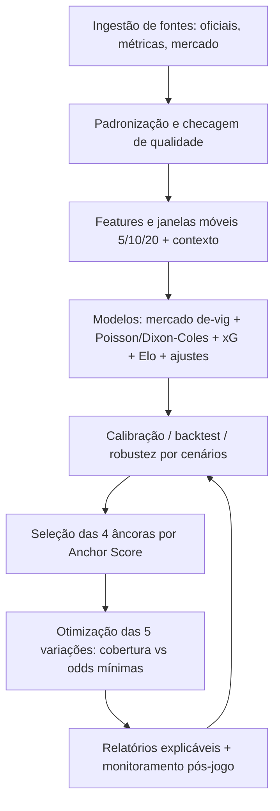

# Bob e a estratégia Big Odds: como definir âncoras e desenhar cinco variações com rigor estatístico

## Resumo executivo

A estratégia **Big Odds** que você descreveu é, na prática, um **problema de otimização probabilística sob restrições**: em cada rodada (ex.: entity["sports_league","Campeonato Brasileiro Série A","top brazil league"]), existem 10 jogos; cada “variação” é um bilhete que seleciona 1 resultado por jogo (tipicamente 1X2), gerando um **acumulador** cuja odd total é (aproximadamente) o **produto** das odds de cada perna. citeturn3search4turn1search8

O papel das quatro **âncoras** (quatro favoritos) é concentrar parte do bilhete em escolhas de **alta probabilidade**, reduzindo o risco global e deixando as demais escolhas “subirem” a odd final (ex.: odds totais 1.000–2.000). Porém, há duas forças matemáticas que atuam contra você e precisam ser modeladas explicitamente no “cérebro” do Bob:

1) **Margem da casa (overround) e composição da margem**: odds publicadas carregam margem; ao combinar várias seleções, a desvantagem tende a se **compor** ao longo das pernas. Isso implica que acumuladores longos podem ter perdas esperadas bem maiores do que apostas simples, mesmo que a odd pareça “atraente”. citeturn1search8turn3search34turn5view0  
2) **Assimetria extrema de payoff (ganhos raros e grandes)**: estratégias que dependem de eventos raros (poucos acertos e grandes pagamentos) podem ter **alto risco de ruína** mesmo quando existe alguma “vantagem” estimada, porque a variância é muito alta e a sequência de perdas pode ser longa. citeturn1search26turn7view0

O “pulo do gato” para transformar Big Odds em engenharia aplicada é:

- tratar as odds de mercado como **baseline forte** e remover margem para obter probabilidades implícitas comparáveis; citeturn1search36turn1search8turn4search6  
- construir um modelo próprio (xG/xGA, Poisson/Dixon–Coles, Elo, regressão/logit, Bayes) para estimar probabilidades **pré-jogo** e medir **incerteza/robustez**; citeturn0search8turn0search1turn0search3  
- definir âncoras por **probabilidade + robustez + baixa ambiguidade de resultado** (ex.: win prob alta e gap grande para empate/derrota), não por “feeling”; citeturn0search1turn0search6turn0search3  
- gerar as 5 variações como um **portfólio**: selecionar 5 combinações distintas que maximizem a **massa de probabilidade coberta** (chance de algum bilhete ser o exato resultado da rodada), respeitando regras do tipster (quantas âncoras por bilhete) e uma restrição de odd total mínima (ex.: ≥1.000). citeturn5view0turn7view0

Ao mesmo tempo, é essencial internalizar um ponto “científico” sobre a sua analogia da Lua: “se aconteceu uma vez, é possível” é verdadeiro no sentido lógico, mas não garante que seja **replicável com frequência econômica**. No mundo de previsões e apostas, há forte evidência de que **odds e mercados preditivos tendem a superar tipsters** em acurácia média; logo, o fato de alguém ter acertado 3 vezes pode ser mistura de competência + seleção + sorte, e precisa ser testado por backtest e calibração. citeturn2search3turn7view0

## A Big Odds como matemática de combinações e “massa de probabilidade”

### O que é, formalmente, uma “variação” em 10 jogos

Considere 10 jogos \(i=1,\dots,10\). Para cada jogo \(i\), existem outcomes possíveis \(j\in\{H,D,A\}\) (casa/empate/fora). Um bilhete \(k\) escolhe exatamente um outcome \(j(i,k)\) por jogo.

- Probabilidade real (do seu modelo): \(p_{i,j}\)  
- Odd “decimal” oferecida: \(o_{i,j}\)

Se você supõe independência entre jogos (aproximação comum quando são partidas distintas), então para o bilhete \(k\):

\[
P(\text{bilhete }k\ \text{ganhar}) \approx \prod_{i=1}^{10} p_{i,j(i,k)}
\]

e:

\[
\text{Odd total}(k) \approx \prod_{i=1}^{10} o_{i,j(i,k)}
\]

A regra “produto das odds” para acumuladores é padrão na explicação de cálculo de payout/odd total em parlays. citeturn3search4

### Por que odds de 1.000–2.000 surgem naturalmente

Se a odd média por jogo for ~2, então \(2^{10}=1024\). Isso explica por que uma rodada inteira, mesmo sem “absurdos”, já pode chegar no patamar que você citou (1.000+). citeturn3search4

Mas também explica por que a probabilidade de acerto costuma ser muito baixa: se uma perna tem probabilidade 0,50 e você precisa de 10, então \(0,5^{10}=0,000976\) (~0,10%). Em campeonatos equilibrados, várias pernas estarão abaixo de 0,50, e a probabilidade cai mais ainda. (Essa parte é aritmética direta do produto.)

### Cinco bilhetes e um detalhe importante: eles normalmente são mutuamente exclusivos

Se cada bilhete especifica **um outcome exato para cada jogo**, então dois bilhetes diferentes não podem ganhar ao mesmo tempo: basta que divergam em pelo menos um jogo, e apenas um outcome ocorrerá nesse jogo.

Assim, em 1X2 “puro” para todos os 10 jogos, os eventos “bilhete \(k\) ganha” são (na prática) disjuntos, e:

\[
P(\text{algum bilhete ganha}) \approx \sum_{k=1}^{5} P(\text{bilhete }k\ \text{ganhar})
\]

Isso é extremamente útil para o Bob: o problema de projetar 5 variações vira “escolher 5 combinações distintas que maximizem a soma das probabilidades (massa)”, sob restrições.

### A barreira invisível: margem (overround) e composição da desvantagem

Bookmakers embutem margem; no 1X2, o **overround** é calculado como a soma das probabilidades implícitas cruas (recíprocos das odds) menos 1:

\[
q_j = 1/o_j,\quad \text{overround} = \sum_j q_j - 1
\]

Essa definição e interpretação são discutidas em trabalhos acadêmicos sobre mercado de odds e em guias técnicos; a ideia central (soma dos inversos maior que 1) aparece explicitamente em estudos sobre overround no futebol europeu. citeturn1search8turn3search31turn4search6

O ponto crítico para Big Odds é que, ao combinar muitas pernas, a “taxa de retorno esperada” (em média) tende a piorar com o número de seleções, porque a margem se compõe. Um argumento econômico explícito é: se uma aposta unitária tem retorno esperado \(1-m\), o retorno esperado de um acumulador com \(N\) pernas ficará próximo de \((1-m)^N\), o que cai rapidamente quando \(N\) aumenta. citeturn5view0

Além disso, há evidência de que apostas mais “complexas” (com mais maneiras de perder e menor probabilidade por outcome) carregam **margens esperadas maiores** que apostas simples, o que reforça a necessidade de modelar EV/risco em vez de olhar só para a odd. citeturn7view0turn3search34

### Um alerta metodológico contra a “teoria da Lua” aplicada a apostas

A ideia “se alguém acertou três vezes, então é replicável” ignora um fenômeno básico em previsão: quando existem muitos apostadores/tipsters, sempre haverá alguns com sequências impressionantes por acaso — e isso não implica capacidade replicável.

Há evidência empírica em futebol de que odds e mercados preditivos podem ter acurácia comparável entre si e, em média, superam tipsters. citeturn2search3  
Somado a isso, produtos de apostas “complexos” exploram vieses cognitivos conhecidos sobre combinações/eventos de baixa probabilidade (por exemplo, dificuldade humana em estimar conjunções), o que reforça a necessidade de backtest e calibração antes de concluir “replicabilidade”. citeturn7view0turn3search34

## Dados e sinais para o Bob: o que coletar, como padronizar e por que confiar

### Fontes prioritárias e por que elas entram no “cérebro”

Para o Bob operar de forma rigorosa, você precisa separar o pipeline em três camadas: **verdades oficiais**, **dados estruturados de performance** e **dados de mercado**.

- Verdades oficiais: sites oficiais de clubes e competições; e, no caso brasileiro, comunicados e tabelas da entity["organization","Confederação Brasileira de Futebol","brazil football confederation"] (classificação, jogos, cartões etc.). citeturn2search22turn2search6  
- Dados estruturados (eventos/métricas): provedores e repositórios como entity["company","StatsBomb","football analytics firm"] (xG, pressão, eventos), entity["company","Wyscout","football scouting platform"] (glossários como PPDA), entity["company","Opta","sports data brand"] via entity["company","Stats Perform","sports data firm"], além de agregadores como entity["organization","FBref","football stats website"] e entity["organization","Understat","football xg site"] (lembrando que modelos diferem). citeturn3search1turn0search3turn3search5turn4search11  
- Contexto de elenco e disponibilidade: entity["company","Transfermarkt","football transfer site"] (como fonte auxiliar) e match centers com escalações prováveis/forma, como entity["company","SofaScore","sports live scores app"] (validando com fontes oficiais quando possível).  
- Mercado: casas/bolsas para odds, volumes e movimentos (por exemplo entity["company","bet365","sportsbook operator"], entity["company","Pinnacle","sportsbook operator"] e entity["company","Betfair","betting exchange"]). A relevância aqui é dupla: baseline preditivo e detecção de “informação nova” via movimento de linha. citeturn1search10turn5view0

### Métricas avançadas são essenciais, mas têm “armadilhas de definição”

**Expected goals (xG)** é, conceitualmente, a probabilidade (0–1) de um chute virar gol baseada em históricos e características do lance. citeturn3search1turn3search5  
Há evidência de que métricas baseadas em xG podem ser melhores preditores de desempenho futuro de times do que estatísticas tradicionais em determinados setups. citeturn0search1turn0search9

Porém:
- xG não é único. Diferentes modelos (ferramentas, features, dados) geram números não diretamente comparáveis. citeturn3search5turn4search11turn4search3  
- Há desafios de avaliação e calibração de modelos de xG, inclusive quando se usa um provedor como referência. citeturn4search3turn4search7turn4search30

**PPDA** é um proxy amplamente usado para “intensidade de pressão”: quantos passes o adversário consegue trocar antes de sofrer uma ação defensiva; menor PPDA sugere pressão mais agressiva. citeturn0search3turn0search11  
Mas pressão é multidimensional, e trabalhos de fornecedores enfatizam que métricas isoladas têm pontos cegos; o ideal é olhar um conjunto de medidas. citeturn4search0turn4search1

**Shot-Creating Actions (SCA)** (no padrão FBref/StatsBomb) creditam as duas ações ofensivas imediatamente anteriores a um chute, oferecendo sinal de “produção sustentável” de finalizações. citeturn3search6turn2search9

image_group{"layout":"carousel","aspect_ratio":"16:9","query":["mapa de chutes xG futebol exemplo","gráfico PPDA pressão alta futebol exemplo","visualização de ações de criação de chute SCA futebol exemplo","gráfico xG diferencial xGD por rodada futebol exemplo"],"num_per_query":1}

### Um esquema de dados mínimo para o Bob (nível jogo e nível time)

Para cada jogo, o Bob deve armazenar (no mínimo) variáveis de:

- **Identificação e contexto**: data/hora, mando (casa/fora), estádio, clima previsto, gramado, viagem/UTC deslocamento, dias de descanso, competição/rodada (a entity["organization","Confederação Brasileira de Futebol","brazil football confederation"] publica calendário e tabelas), árbitro. citeturn2search6turn2search22  
- **Disponibilidade**: lesões/suspensões/retornos e “qualidade do substituto” (proxy por minutos, participação em SCA/xGChain, rating interno etc.).  
- **Performance padronizada**: rolling windows (5/10/20 jogos) para xG, xGA, xGD, chutes, xG/shot, PPDA/OPPDA (com metodologia), SCA/90, bolas paradas, cartões. citeturn3search1turn0search3turn3search6  
- **Mercado**: odds de abertura/fechamento, overround, probabilidades sem margem, dispersão entre casas e, se houver, dados de exchange. citeturn1search10turn1search8turn1search36

## Probabilidades por jogo: modelos recomendados e como alinhá-los ao mercado

### Comece pelo mercado, mas “limpe” a margem

Para odds decimais \(o_j\), probabilidade implícita crua \(q_j=1/o_j\). Como existe overround, você precisa remover a margem para comparar com seu modelo.

Métodos aceitos na literatura aplicada incluem normalização (multiplicativo) e métodos que lidam com vieses de favorito-longshot (Shin, power etc.). citeturn1search36turn4search6turn4search2

- **Normalização simples** (multiplicativo):

\[
p_j^{mkt}=\frac{q_j}{\sum q}
\]

- **Power method** (ideia): encontrar um expoente \(\alpha\) que ajuste as probabilidades para somarem 1, aplicando \(q_j^\alpha\) e renormalizando; Clarke et al. discutem e comparam métodos, destacando que o power method evita problemas como probabilidades fora de \([0,1]\) e pode capturar estruturas de margem associadas a vieses. citeturn4search6turn4search10

### Modelo de gols: Poisson e Dixon–Coles para 1X2

A base clássica para previsão de placares é modelar gols como contagens (Poisson), estimando forças ofensivas/defensivas e efeito de mando; o modelo de entity["people","Mark J. Dixon","statistician"] e entity["people","Stuart G. Coles","statistician"] (1997) é referência por tratar particularidades do futebol (como correções em placares baixos) e discutir ineficiências de mercado no contexto de odds. citeturn0search8turn0search4turn0search16

Um esqueleto operacional (simplificado) para um jogo \(X\) vs \(Y\):

\[
G_X\sim Poisson(\lambda_X),\quad
G_Y\sim Poisson(\lambda_Y)
\]

com \(\lambda\) função de ataque/defesa, mando e forma (podendo usar xG como proxy). A partir da matriz \(P(G_X=a,G_Y=b)\), calcula-se \(P(X\ vence)\), \(P(empate)\), \(P(Y\ vence)\).

**Por que isso importa para âncoras?** Porque âncora é, essencialmente, jogo com \(P(\text{favorito vence})\) alto e, idealmente, com baixo \(P(empate)\) e baixo \(P(derrota)\).

### xG como sinal de “processo” e não apenas de resultado

Definição operacional: xG mede probabilidade do chute virar gol, usando históricos de chutes similares; xG agregado mede qualidade/quantidade de chances criadas. citeturn3search1turn3search5

Evidência empírica sugere que xG pode ser melhor preditor de sucesso futuro do que estatísticas tradicionais em certos contextos, tornando-o útil para separar “time que jogou bem e perdeu” de “time que ganhou sem criar muito”. citeturn0search1turn0search9

Mas o Bob deve modelar:
- incerteza e comparabilidade entre provedores (xG varia entre modelos); citeturn4search11turn4search3turn3search5  
- e o fato de que xG olha para chutes observados; abordagens recentes discutem extensões além do xG para modelar também ocorrência de chutes. citeturn4search30turn3search21

### Pressão: PPDA e eventos de pressão

PPDA tem definição operacional clara em glossários (passes permitidos por ação defensiva em certas zonas), útil para capturar estilos de pressão e como isso “casa” com adversários. citeturn0search3turn0search11  
Além de PPDA, dados de “pressure events” em provedores como StatsBomb permitem richer features (localização e consequências da pressão), e fornecedores publicam especificações/glossários de eventos. citeturn4search1turn4search16turn4search5

### Um ensemble pragmático (recomendação de engenharia)

Em vez de escolher “um modelo”, o Bob pode produzir uma probabilidade final por jogo como combinação de:

- **prior do mercado** (probabilidades sem margem), porque odds agregam muita informação; há estudos sobre eficiência e vieses em 1X2 e outros mercados. citeturn0search6turn0search2turn4search6  
- **ajuste por performance** (xGD, PPDA, SCA, etc.), porque métricas de processo podem capturar under/overperformance; citeturn0search1turn0search3turn3search6  
- **ajuste de contexto** (lesões, descanso, viagem, escalação provável), como fatores de covariância.

Um formato simples e auditável é o “pooling” logarítmico:

\[
\tilde{p}_j \propto (p^{mkt}_j)^{(1-w)}(p^{model}_j)^{w},\quad
p_j=\frac{\tilde{p}_j}{\sum_k \tilde{p}_k}
\]

Isso mantém o mercado como baseline, mas permite que sinais fortes (ex.: xGD muito superior + contexto favorável) deslocem a crença.

## Como definir as quatro âncoras com robustez e “cercar” rodadas difíceis

### Definição operacional de âncora

Uma âncora (no sentido da sua estratégia) deve satisfazer simultaneamente:

- **Probabilidade alta de vitória do favorito**  
- **Baixa ambiguidade** (diferença grande entre “vitória do favorito” e o melhor alternativa: empate ou derrota)  
- **Robustez** (a probabilidade não despenca muito quando você muda cenários plausíveis: “titular dúvida fora”, “viagem pesada”, “escalou reserva”)  
- **Alinhamento razoável com o mercado**, a menos que você tenha informação nova verificável (escalação confirmada, por exemplo). A literatura indica que odds tendem a ser muito competitivas; tipsters, em média, performam pior do que odds/mercados preditivos. citeturn2search3turn0search6

### Um “Anchor Score” prático para o Bob

Defina para cada jogo um favorito \(F\) (time com maior \(P(win)\) no seu ensemble). Calcule:

1) **Probabilidade do favorito vencer**: \(p_W = P(F\ vence)\)  
2) **Margem de confiança**: \(gap = p_W - \max(P(empate), P(F\ perde))\)  
3) **Entropia** (incerteza geral do jogo):

\[
H = -\sum_{j\in\{W,D,L\}} p_j \log p_j
\]

4) **Penalty de robustez**: simule cenários (ex.: com/sem jogador-chave) e compute queda máxima \(\Delta p_W\)  
5) **Penalty de “alerta de mercado”**: diferença grande entre \(p_W\) e \(p^{mkt}_W\) após de-vig, especialmente se não houver notícia que explique.

Então:

\[
Score_{ancora} = a\cdot p_W + b\cdot gap - c\cdot H - d\cdot \Delta p_W - e\cdot |p_W - p^{mkt}_W|
\]

Os pesos \(a,b,c,d,e\) devem ser aprendidos por backtest (otimizando taxa de acerto/calibração para “favoritos fortes”), não escolhidos no “olhômetro”.

### Checklist passo a passo para selecionar âncoras (operacional)

O Bob pode executar este checklist para cada rodada:

1) Reunir odds de múltiplas casas e remover overround (normalização + método power/Shin como auditoria). citeturn1search36turn4search6turn1search8  
2) Estimar \(p^{model}\) por jogo com ensemble (mercado como prior + ajustes de xG/xGA/xGD, PPDA, SCA, casa/fora e contexto). citeturn0search1turn0search3turn3search6turn4search0  
3) Para cada jogo, calcular \(p_W\), \(gap\), entropia \(H\) e robustez \(\Delta p_W\).  
4) Filtrar candidatos a âncora com thresholds mínimos (exemplo): \(p_W\ge 0{,}55\) e \(gap\ge 0{,}15\). (Os valores ideais dependem do campeonato e devem ser calibrados por backtest.)  
5) Penalizar jogos com grande incerteza de escalação/lesões (cenários) e/ou grande divergência não explicada vs mercado. citeturn4search6turn2search3  
6) Ordenar por \(Score_{ancora}\) e escolher as 4 melhores.  
7) Se a rodada for muito equilibrada e não houver 4 jogos acima dos thresholds, o Bob deve **rebaixar a ambição**: ou aceitar âncoras mais fracas (assumir maior risco), ou trocar o tipo de âncora (ex.: “não perde”/DNB) — lembrando que isso mexe na odd total e na estratégia de alcançar 1.000+. (Esse trade-off é inevitável.)

### Tabela comparativa sugerida (para ranquear candidatos a âncora)

Abaixo está um **esquema** (com valores hipotéticos). Ele é útil porque obriga o Bob a justificar “por que este favorito é âncora” com múltiplas dimensões:

| Métrica (janela +90) | Favorito (F) | Oponente | Diferença | Interpretação para âncora |
|---|---:|---:|---:|---|
| \(P(F\ vence)\) (ensemble) | 0,62 | — | — | Quanto maior, melhor |
| Gap vs 2º outcome | 0,22 | — | — | Jogo menos “empateiro/coinflip” |
| xG /90 | 1,70 | 1,05 | +0,65 | Produção ofensiva superior (processo) citeturn3search1turn0search1 |
| xGA /90 | 0,95 | 1,35 | −0,40 | Defesa concede menos qualidade citeturn3search1turn0search1 |
| xGD /90 | +0,75 | −0,30 | +1,05 | Dominância de chances (forte sinal) citeturn0search1 |
| PPDA (F) | 9,0 | 14,0 | — | Pressão alta; validar contexto citeturn0search3turn4search0 |
| SCA /90 | 23 | 16 | +7 | Criação consistente de chutes citeturn3search6turn2search9 |
| Casa/fora: xGD (F em casa) | +0,85 | — | — | Mando reforça a âncora |
| Robustez: \(\Delta p_W\) (cenários) | 0,04 | — | — | Queda baixa = âncora robusta |
| Divergência vs mercado (de-vig) | +0,03 | — | — | Pequena divergência = menos “alerta” citeturn1search36turn4search6 |

## Construção das cinco variações como portfólio: maximizar cobertura com odds altas

### Reenquadrando “variações” como seleção dos 5 resultados mais prováveis sob restrições

Se você precisa de odds totais ≥ 1.000, você está impondo uma restrição:

\[
\prod_{i=1}^{10} o_{i,j(i,k)} \ge O_{min}
\]

A melhor forma de “cercar o máximo possível” é escolher 5 combinações diferentes que maximizem:

\[
\sum_{k=1}^{5}\prod_{i=1}^{10} p_{i,j(i,k)}
\]

(assumindo bilhetes disjuntos no 1X2 puro).

Essa lógica é superior a “misturar por intuição” porque formaliza o objetivo: **aumentar a chance de algum bilhete ser exatamente o retrato da rodada**, dado que apenas um bilhete pode ganhar quando cada um fixa outcomes para todos os jogos.

### Como incorporar as âncoras na otimização

Você descreveu um padrão de bilhetes: um com 4 âncoras; outros com 3, 2 etc. Isso pode ser formalizado como restrições:

- Seja \(A\) o conjunto de 4 jogos âncora e \(j^*_i\) o outcome âncora do jogo \(i\in A\) (normalmente “vitória do favorito”).  
- Para cada bilhete \(k\), imponha \(\sum_{i\in A}\mathbb{1}[j(i,k)=j^*_i]\ge r_k\), onde \(r_k\in\{2,3,4\}\) conforme a variação.

Assim, você gera diversidade (alguns bilhetes “protegem” contra a falha de uma âncora) sem abandonar completamente o núcleo probabilístico.

### Uma heurística forte e implementável: busca em feixe (beam search) em log-escala

Como o espaço total é \(3^{10}=59.049\) combinações (no 1X2 puro), dá até para enumerar; mas o Bob pode ser genérico para outros campeonatos e mercados.

Trabalhe em log para estabilidade numérica:

- \(\log P(k)=\sum_i \log p_{i,j(i,k)}\)  
- \(\log O(k)=\sum_i \log o_{i,j(i,k)}\)

A busca em feixe mantém apenas as melhores “parciais” (prefixos de jogos) por \(\log P\) e vai expandindo, aplicando filtros de âncora e atingimento de \(\log O_{min}\).

Esse desenho é coerente com a natureza “combinatória” de acumuladores e com o fato de que o objetivo é capturar massa de probabilidade sob restrição de odds.

### Exemplo numérico hipotético (mini-rodada para ilustrar)

Suponha 4 jogos (para simplificar) com probabilidades do ensemble e odds:

- Jogo 1: outcomes A (0,55; odd 1,95), D (0,25; 3,40), B (0,20; 4,10)  
- Jogo 2: outcomes A (0,60; 1,75), D (0,23; 3,60), B (0,17; 4,80)  
- Jogo 3: outcomes A (0,45; 2,20), D (0,30; 3,10), B (0,25; 3,00)  
- Jogo 4: outcomes A (0,50; 2,05), D (0,28; 3,25), B (0,22; 3,80)

Se você exigir odd total ≥ 20 (apenas como analogia ao “≥1000” no caso real), o Bob pode listar as combinações que passam da restrição e escolher as top-5 por probabilidade. Isso é exatamente o mesmo problema, só em escala menor.

### Por que “EV” e risco precisam estar no núcleo do Bob (não só “probabilidade de acertar”)

Mesmo que seu objetivo seja “acertar pelo menos uma vez”, você ainda precisa modelar:

- **retorno esperado** e **taxa de perda esperada** em acumuladores longos, porque a margem compõe; citeturn5view0turn1search8turn7view0  
- **risco de ruína**, porque o caminho típico é muitas perdas seguidas; estratégias com payoff assimétrico podem ter alta probabilidade de quebrar antes do “grande acerto”. citeturn1search26turn7view0

Isso não é “moralismo”; é simplesmente a matemática do processo.

## Validação, riscos, governança e o “cérebro” autônomo do Bob

### Backtest correto: evitar “vazamento de informação” (data leakage)

Para uma aplicação como Bob, o histórico precisa refletir apenas o que era conhecido **antes** do jogo:

- Para features de escalação/lesão, usar o que estava disponível em boletins e notícias pré-jogo;  
- Para odds, registrar abertura e fechamento (ou snapshots). Há literatura e evidência aplicada sugerindo que odds finais podem ser mais “corretas” do que iniciais em média, refletindo absorção de informação. citeturn1search10turn1search18turn5view0

Sem esse cuidado, o Bob “parece genial” no passado e falha no futuro.

### Métricas de avaliação que o Bob deveria usar

Para probabilidades 1X2:
- **Log loss** e/ou **Brier score** (calibração e sharpness) — úteis porque avaliam previsões probabilísticas e punem excesso de confiança.  
- **Curvas de confiabilidade**: se o Bob diz “60%”, isso acontece ~60%?

Para âncoras:
- **Hit rate por faixa de \(p_W\)** (ex.: âncoras com 0,60–0,65 acertam quanto?)  
- **AUC/Ranking quality** para o “Anchor Score” (quão bem ranqueia jogos realmente mais seguros?)

Para portfólio de 5 bilhetes:
- estimar \(P(\text{algum bilhete})\) no histórico e comparar com o obtido de fato. Se houver diferença sistemática, o modelo de independência/precisão está errado.

### Riscos estruturais específicos da Big Odds

- **Viés de favorito–longshot e ineficiências por mercado**: há evidência recente apontando vieses fortes no mercado tradicional 1X2 e diferenças versus mercados alternativos. Isso importa porque, se você usa odds como baseline, você precisa saber quando o baseline é enviesado. citeturn0search6turn0search2turn3search0  
- **Produtos complexos e margens maiores**: apostas combinadas e complexas tendem a ser mais lucrativas para a casa do que apostas simples, o que agrava a necessidade de edge real para sustentar o sistema. citeturn7view0turn5view0  
- **Overconfiança do modelo** (um risco técnico): xG e pressão são métricas úteis, mas modelos diferem, têm desafios de avaliação e podem induzir excesso de confiança se não houver calibração. citeturn4search3turn4search11turn0search1

### Governança do “cérebro” (autonomia com controle)

Se o Bob vai “buscar conhecimento autonomamente”, a chave é separar:

- **Aquisição** (crawler/ETL + curadoria de fontes confiáveis)  
- **Memória/Conhecimento** (base vetorial + banco relacional + versionamento de dados)  
- **Raciocínio** (modelos probabilísticos e regras auditáveis)  
- **Ação** (geração de âncoras, geração das 5 variações, estimativas de risco e explicações)

E impor “gates”:
- nenhum modelo novo entra em produção sem backtest e melhora consistente em calibração/robustez;  
- qualquer atualização de fonte/metodologia (ex.: troca de provedor de xG) passa por revalidação, porque números mudam com definições. citeturn3search5turn4search3turn4search6

Um fluxo (Mermaid) que espelha essa governança:

### Contexto regulatório brasileiro (relevante para produto e risco operacional)

Como você está construindo uma aplicação ligada a apostas, existe um “entorno” regulatório que o Bob (e o seu produto) não podem ignorar. A Lei nº 14.790/2023 trata das **apostas de quota fixa** e atribui ao Ministério da Fazenda o papel de autorizar e regular a exploração, com necessidade de autorização prévia. citeturn8search0turn8search5  
O governo federal mantém páginas oficiais para a **Secretaria de Prêmios e Apostas** e publicou atos regulatórios e notícias de regulamentação alinhadas à lei. citeturn8search2turn8search3

Esse ponto não “muda a matemática” da Big Odds, mas muda requisitos de compliance, dados e integrações permitidas — o que é crítico para um produto real. citeturn8search2turn8search5